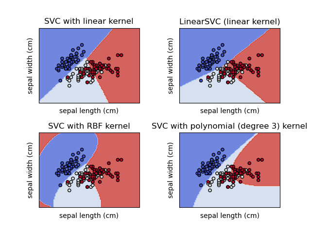

# Loan Prediction using Support Vector Machine Model

Support Vector Machines (linear kernel) was the training model used.

"Support vector machines (SVMs) are a set of supervised learning methods used for classification, regression and outliers detection.

The advantages of support vector machines are:

- Effective in high dimensional spaces.

- Still effective in cases where number of dimensions is greater than the number of samples.

- Uses a subset of training points in the decision function (called support vectors), so it is also memory efficient.

- Versatile: different Kernel functions can be specified for the decision function. Common kernels are provided, but it is also possible to specify custom kernels.

The disadvantages of support vector machines include:

- If the number of features is much greater than the number of samples, avoid over-fitting in choosing Kernel functions and regularization term is crucial.

- SVMs do not directly provide probability estimates, these are calculated using an expensive five-fold cross-validation (see Scores and probabilities, below)." [1]

### Test Data Metrics

Accuracy score:  0.8176100628930818

Precision score:  0.9727272727272728

Recall score:  0.8045112781954887

f1_score:  0.8806584362139919

Confusion matrix:

[[ 23   3]
 [ 26 107]]

The code is further commented.

[1] - <https://scikit-learn.org/stable/modules/svm.html#regression>
